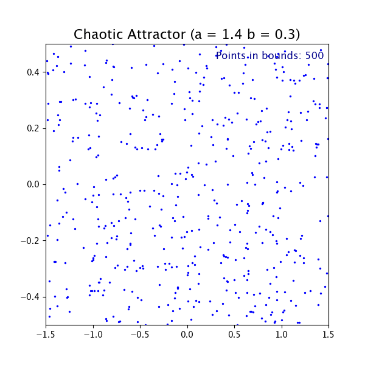
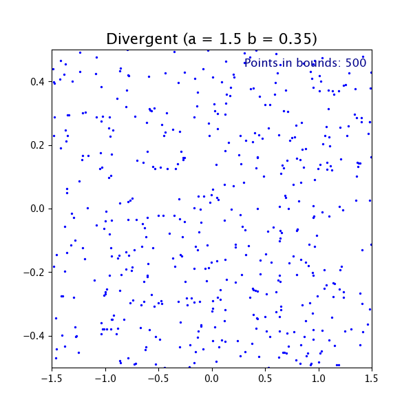

# Analysing Chaos Using Lyapunov Exponents

This project is an analysis on different kinds of 
chaotic systems and analysis on the chaotic nature 
observed in them using Lyapunov Exponent.

### Implementation
**Installation**
```
git clone https://github.com/Sammybro11/Chaos-using-Lyapunov 
cd Chaos-using-Lyapunov
```
**Python Virtual Environment**
```
python3 -m venv env
source env/bin/activate
```
**Installing required Packages**
```
pip install -r requirements.txt
```


## Physics and Analysis

### Hénon Maps

We start with a relatively simple example called a
[Hénon Map](https://en.wikipedia.org/wiki/H%C3%A9non_map). 
The Hénon map is a discrete-time dynamical system. It is one of the most studied examples of dynamical systems that exhibit chaotic behavior. 

The Hénon map takes a point ($x_n$, $y_n$) in the plane and maps it to a new point:
```math
\begin{cases}
x_{n+1} &= 1 - ax^2_n + y_n \\
y_{n+1} &= bx_n
\end{cases}
```

### Methodology

The **Lyapunov exponents** measure the average exponential rate at which nearby trajectories separate (or converge).  

For a 2D map such as the Hénon system, there are two exponents $\lambda_1$ and $\lambda_2$:  

- If $\lambda_1 > 0$, the system is chaotic (sensitive dependence on initial conditions).  
- If both exponents are negative, trajectories converge to a fixed point.  
- If one is positive and the other negative, trajectories collapse onto a fractal attractor (strange attractor).  
- Their sum satisfies:
  $$
  \begin{aligned}
  \lambda_1 + \lambda_2 &= \langle \ln |\det(J(x,y))| \rangle
  \end{aligned}
  $$
  where $J(x,y)$ is the Jacobian of the map. For Hénon, $\det(J) = -b$, so $\lambda_1 + \lambda_2 = \ln |b|$.  

---

#### Jacobian evolution

The Jacobian of the Hénon map is:  

```math
J(x,y) =
\begin{bmatrix}
-2ax & 1 \\
b & 0
\end{bmatrix}.
```

We track the evolution of small perturbation vectors under this Jacobian. At each step:  

```math
\mathbf{u}' = J(x,y)\mathbf{u}
```

The growth of these perturbations encodes the Lyapunov exponents.

Since divergence can lead to explosion in the length of these perturbation vectors we apply the Modified Gram Schmidt Orthonormalization Numerical Method, 

1. Start with an orthonormal basis of perturbation vectors $V =\{v_1, v_2\}$.  
2. At each iteration of the Hénon map:
   - Advance the point $(x,y)$ using the Hénon equations.  
   - Apply the Jacobian to the current basis and perform QR Decomposition: 
     ```math
     \begin{aligned}
     W &= J(x,y) V \\
     W &= QR
     \end{aligned}
     ```
     where $Q$ is orthonormal and $R$ is upper-triangular.  
   - The diagonal entries of $R$ represent the stretching factors along each direction before renormalization.  
   - Accumulate:  
     ```math
     \begin{equation}
     \lambda_i \approx \frac{1}{N}\sum_{n=1}^N \ln |R_{ii}(n)|
     \end{equation}
     ```  
3. Replace $V \leftarrow Q$ and repeat.  

This ensures numerical stability: vectors remain orthogonal, and exponential growth/decay is tracked through the logs of the $R$ diagonals. 

---

### Results  

- **Heatmaps**: Figures 1 and 2 show the computed values of $\lambda_1$ and $\lambda_2$ across a grid of $(a,b)$ values.  
  - Red regions ($\lambda_1 > 0$) correspond to chaotic dynamics.  
  - Blue regions ($\lambda_1 < 0$) correspond to convergence to periodic or fixed points.  
  - Darker regions indicate divergence (trajectories escape to infinity).

| Largest Lyapunov Exponent $\lambda_1$       | Smallest Lyapunov Exponent $\lambda_2$       |
|---------------------------------------------|----------------------------------------------|
|  |  |


- **GIFs**: Three animations illustrate how initial conditions evolve under different parameter choices:  
  1. **Convergence**: trajectories collapse to a fixed point.  
  2. **Divergence**: trajectories escape to infinity.  
  3. **Chaos**: trajectories settle onto a strange attractor with fractal geometry.  

| Convergence                          | Chaos                         | Divergence                         |
|--------------------------------------|-------------------------------|------------------------------------|
|  |  |  |

Together, these visualizations demonstrate how Lyapunov exponents capture the transition between order and chaos in the Hénon map. 


### Peter De Jong Maps


